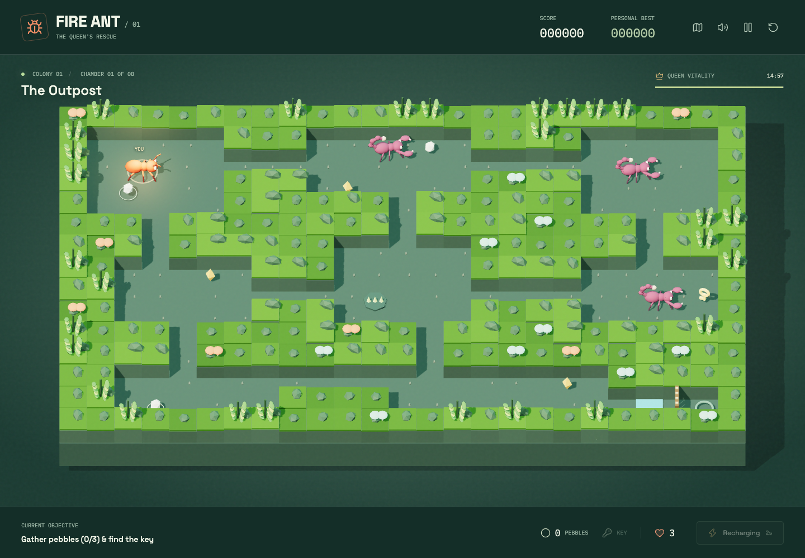
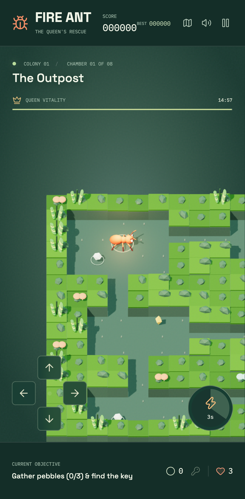

# Fire Ant

A playable browser reimagining of the 1983 C64 underground rescue adventure.
Explore eight chambers, outmaneuver scorpions, build crossings, and bring the
queen home. Original Three.js cutaway scenery and procedural Web Audio chiptunes.

## Screenshots

### Desktop



### Mobile



## Run Locally

Requires Node.js 22 or a newer supported LTS release, and npm.
The browser must support WebGL 2 and Web Audio. No accounts, API keys, or backend
services are required.

```bash
npm ci
npm run dev
```

Open the local URL printed by Vite (normally <http://127.0.0.1:5173>).
Click **Enter the colony** to start. Music begins only after interaction.

```bash
npm run build
npm run preview
```

The production output is `dist/`. Serve that directory with a static web server;
opening the HTML directly from disk will not load the module bundle correctly.

## Play

| Control | Action |
| --- | --- |
| Arrow keys or W/A/S/D | Move |
| Space or the lightning button | Pheromone pulse; place a pebble near water |
| Escape, P, or pause icon | Pause / resume |
| M or speaker icon | Mute / unmute |
| Map icon | Toggle chamber overview on the follow camera |
| Restart icon or paused/victory dialog | Confirm a fresh rescue |
| Touch arrows + lightning button | Mobile movement and action |

Collect the **three pale pebbles** and **golden key** in each chamber. Carry the
pebbles to the turquoise water crossing and press the action button three times
to fill it. The key opens the wooden gate; enter the glowing ring to advance.
Amber crystals award optional bonus points.

Scorpions patrol and chase nearby soldiers. A pheromone pulse stuns nearby
scorpions for 3.2 seconds, with a four-second recharge. Green vents periodically
become dangerous. Contact costs one life and returns you to the chamber entrance
with brief invulnerability; collected objects stay collected. Clearing a chamber
restores one life, up to five.

The queen has **15 minutes of active play** across all eight chambers. Pausing
freezes the rescue and silences audio. Losing all lives or running out of time
ends the run. Rescue her in chamber eight to enter another colony with your score
intact and faster scorpions. A normal restart resets the run, not the local best.
Switching away from the browser automatically pauses play.

Scores live only in this browser's local storage. If storage is blocked, gameplay
still works, but the best score cannot persist after reloading.

## Verification

```bash
npm test
npm run build
npx playwright install chromium
npm run test:e2e
bash scripts/openspec check --strict
bash scripts/openspec verify fire-ant-browser
bash scripts/openspec status fire-ant-browser
```

OpenSpec additionally requires Bash, Git, and Ruby >= 2.6. Browser tests use an
isolated local server on port 5174 and capture screenshots in `test-results/`.
Their state-inspection bridge exists only when `VITE_TEST_MODE=1`; never set that
variable for a production build.

Unit tests cover collisions, inventory, pulse cooldown, damage, hazards, timeout,
pause/restart, and an eight-chamber route through the movement and puzzle rules.
The route test disables damage to isolate reachability; it does not establish
human difficulty balance. Browser tests cover real keyboard and touch events,
game screens, storage denial, WebGL pixels, and audio state. Listening quality
and human play balance still require manual review.

## Architecture

| File | Responsibility |
| --- | --- |
| `src/game.ts` | Deterministic simulation and A* scorpion routing |
| `src/levels.ts` | Eight chamber layouts and object placement |
| `src/scene.ts` | Procedural Three.js scenery and insect animation |
| `src/audio.ts` | Original melody, bass, percussion, and effects |
| `src/main.ts` | Input, game screens, HUD, and local best score |

## Original Game Credits

This browser reimagining pays tribute to the original **Fire Ant** for the
**Commodore 64**:

| Credit | Original game |
| --- | --- |
| Programmer | **Mike Wacker** |
| Publisher | **Mogul Communications Ltd. / Victory Software** |
| Release year | **1983** |
| Musician | None credited in the supplied release metadata |

Credits are transcribed from the supplied C64 release notes. The original game
and its creators are distinct from this browser reimagining; its new artwork,
code, and chiptunes are not attributed to the original creators. This project
does not claim their endorsement or ownership of the original game's rights.

## References And Scope

User-supplied instructions and screenshots establish the queen rescue and
eight-chamber structure. The supplied assembly also contains an eight-chamber
counter reset.

This is a reimagining, not an emulator or exact port. Layouts, crossing puzzles,
pheromone defense, visuals, and music are original implementations. The local
T64, PRG, and assembly references under ignored `stuff/` are not distributed in
the browser build. No original game artwork, music, or program code is embedded.
The MIT license covers this repository's original code, not third-party game
rights. Dependencies and fonts retain their own licenses.

## Contributing And Security

Follow [AGENTS.md](AGENTS.md) and [CONTRIBUTING.md](CONTRIBUTING.md). Changes need
a review-ready OpenSpec with acceptance criteria, tests, and documentation.
The current spec is [fire-ant-browser](.openspec/specs/fire-ant-browser.spec.yaml).
Passing tests are evidence, not human approval or permission to merge.

See [SECURITY.md](SECURITY.md) for private reporting and development-server safety,
[SUPPORT.md](SUPPORT.md) for help, and [CHANGELOG.md](CHANGELOG.md) for history.
No cloud deployment or remote repository settings are configured by game setup.

## License

[MIT](LICENSE)

---

## Browser Reimagining Developer

Eduardo Arana

## Support this with a ko-fi

[](https://ko-fi.com/H2H51MPWG)
